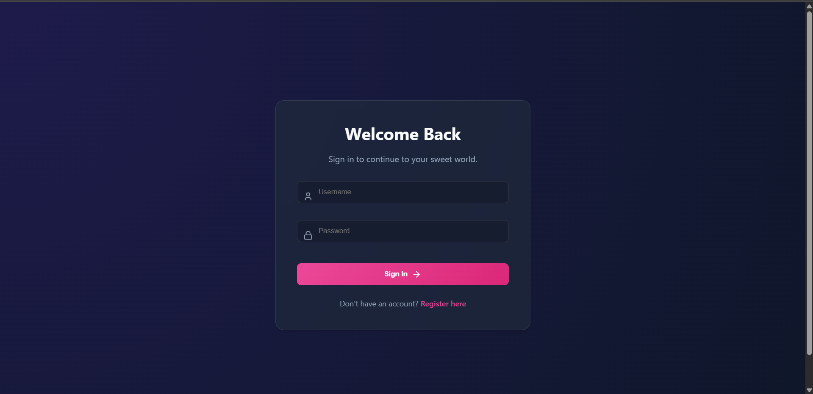
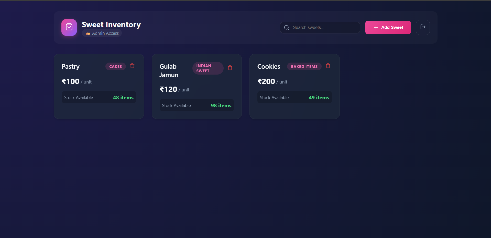
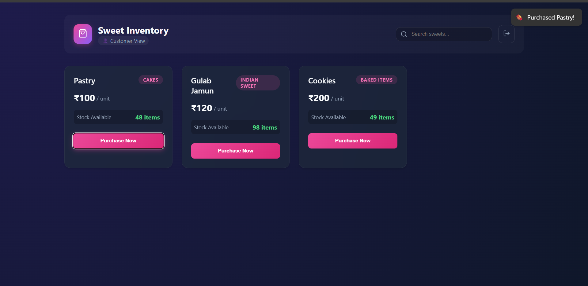

# 🍬 Sweet Shop Management System

A modern, full-stack web application designed for managing a boutique sweet shop. This system allows customers to browse and purchase sweets, while providing administrators with tools to manage inventory, update stock, and handle product listings.

Built with **Java Spring Boot** for a robust backend and **React (Vite)** for a dynamic, responsive frontend. The application features a premium "Glassmorphism" UI design with smooth animations.

---

## ✨ Features

### 🛒 For Customers
*   **Browse Inventory**: View a beautiful grid of available sweets.
*   **Search & Filter**: Instantly find sweets by name or category.
*   **Purchase System**: Buy sweets with a single click (automatically updates stock).
*   **Real-time Stock Status**: Visual indicators for low stock and "Out of Stock" items.
*   **Responsive Design**: Works seamlessly on desktop and mobile.

### 👑 For Administrators
*   **Inventory Management**: Add, update, and delete sweets.
*   **Stock Control**: Monitor quantity levels.
*   **Secure Access**: Role-based authentication ensures only admins can modify data.

### 🔐 Technical Highlights
*   **JWT Authentication**: Secure login and registration system.
*   **Role-Based Access Control (RBAC)**: Distinct permissions for `ROLE_USER` and `ROLE_ADMIN`.
*   **MongoDB Atlas**: Cloud-hosted NoSQL database for flexible data storage.
*   **Animated UI**: Powered by `framer-motion` for delightful interactions.
*   **Notifications**: Toast notifications for user feedback.

---

## 🛠️ Technology Stack

| Component | Technology |
| :--- | :--- |
| **Backend** | Java 21, Spring Boot 3.4, Spring Security, JWT (jjwt) |
| **Database** | MongoDB Atlas (Cloud) |
| **Frontend** | React 18, Vite, Axios, React Router 6 |
| **Styling** | CSS Variables, Glassmorphism, Lucide React (Icons) |
| **Animation** | Framer Motion |
| **Utilities** | React Hot Toast |

---

## 🚀 Setup & Run Instructions

### Prerequisites
*   **Java JDK 21** or higher
*   **Node.js** (v18 or higher) & npm
*   **Maven**

### 1. Backend Setup (`sweet-shop-api`)

The backend is pre-configured to connect to a shared MongoDB Atlas cluster.

1.  Open a terminal and navigate to the API directory:
    ```bash
    cd sweet-shop-api
    ```
2.  Run the application using Maven:
    ```bash
    mvn spring-boot:run
    ```
3.  The server will start on `http://localhost:8080`.

### 2. Frontend Setup (`sweet-shop-client`)

1.  Open a new terminal and navigate to the client directory:
    ```bash
    cd sweet-shop-client
    ```
2.  Install dependencies:
    ```bash
    npm install
    ```
3.  Start the development server:
    ```bash
    npm run dev
    ```
4.  The application will be accessible at `http://localhost:5173`.

---

## 📸 Screenshots

> *Please replace the placeholders below with actual screenshots of your running application.*

### 1. **Login Page**
*Elegant glassmorphism login screen.*


### 2. **Dashboard (User View)**
*Browsing sweets and making purchases.*


### 3. **Dashboard (Admin View)**
*Admin interface with "Add Sweet" and "Delete" controls.*


### 4. **Add Sweet Modal**
*Smooth modal for adding new inventory.*


---

## 🤖 My AI Usage

This project was developed with the assistance of **Antigravity**, an advanced AI coding agent.

*   **Architectural Guidance**: The AI helped design the separation of concerns between the Spring Boot API and React Client.
*   **Code Generation**:
    *   **Backend**: Generated boilerplate for Controllers, Services, and Repositories. 
    *   **Frontend**: Created React components, implemented routing, and designed the CSS theme.
*   **Refactoring & Enhancement**: The AI refactored the frontend to introduce `framer-motion` animations, `react-hot-toast` notifications, and role-based conditional rendering.
*   **Debugging**: Assisted in resolving dependency issues (Maven/NPM) and fixing CORS configuration errors.

---

